# 在线编程

## 产品概述

### 产品介绍

    Open在线编程SDK（codemirror-sdk）, 由于所有教学项目中都有用到在线编程的需求，  
    为了节约小伙伴们的工作时间，故将此功能进行二次封装，提取成公共组件

### 基本概念

    在线编程也称在线IDE，是指不需要经过安装编程的环境，直接在互联网浏览器上编写程序，并且可以运行出结果

#### 原理

    在线编程的原理比较复杂，因为其涉及web前端以及后端编译系统。  
    web前端需要提供用户代码录入，行号、高亮语法、自动补全功能。  
    并需要使用异步更新(Ajax) 的方法来实现上述功能。  
    后端编译系统接收到用户的代码，并调用正确的编译器进行编译并将结果返回前端进行显示

#### 特性

1. 方便:无论何时何地，打开网址，就可以进行代码编写。  
    更可以将现有代码拷贝过去运行验证结果，是验证代码，学习语言、算法的快捷工具。  
    而且再也不需像传统一样，为了编写一点程序，就必须在自己电脑上安装很大的软件，配置非常复杂的环境。  
2. 跨平台:无论使用Windows、Mac、Linux还是使用安卓平板、iPad，都可以进行在线编程，  
    而且编程语言可以是任何语言，在iPad上编写Java代码是件很轻松地事。
3. 集成性：所有的在线编程的编程语言网站都支持多种语言的编译或解释，具有较强的集成性，是传统IDE无法比拟的。

### CodeMirrir

    站在巨人的肩膀上前进，经过不断筛选，最终确定了CodeMirrir。  
    CodeMirror是一个通用的文本编辑器，用JavaScript为浏览器实现。  
    它专门用于编辑代码，并附带了许多实现更高级编辑功能的语言模式和插件。  

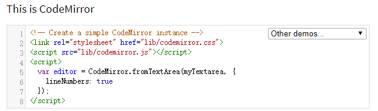

### 引入方式

```js
import 'codemirror-sdk/dist/css/sdk.min.css'
let codemirrorSdk = require('codemirror-sdk').codemirrorSDK;
var Online_Programming = new codemirrorSdk({});
```

```js
Browser:
//按自己目录位置确定
<link rel="stylesheet" href="/dist/css/sdk.min.css">
<script src="/dist/js/sdk.min.js"></script>
var Online_Programming = new codemirrorSDK.OnlineProgramming({})
```

### codemirror-sdk支持功能

1.
>支持禁用粘贴功能
>>isPaste:true
>>>支持ie11

2.
>支持禁止输入功能
>>readOnly:true
>>>支持ie11

3.
>支持左右 上下拖动
>>支持ie11
>>>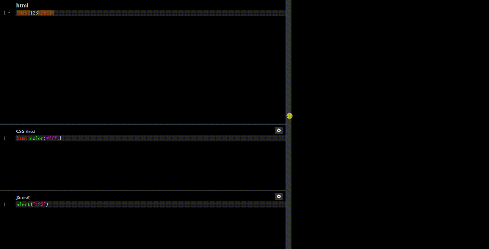

4.
>支持配置外部链接

```js
//eg
defaultExternalLink: {  //默认引入的外部链接
                'css': [
                    'http://fedcdn.open.com.cn/fedcdn/OnlineCode/bootstrap.min.css'
                ],
                'js': [
                    'http://fedcdn.open.com.cn/fedcdn/OnlineCode/vue.js',
                    'http://fedcdn.open.com.cn/fedcdn/OnlineCode/jquery.min.js'
                ]
            },
```

5. 
>支持手动输入外部链接引入
>>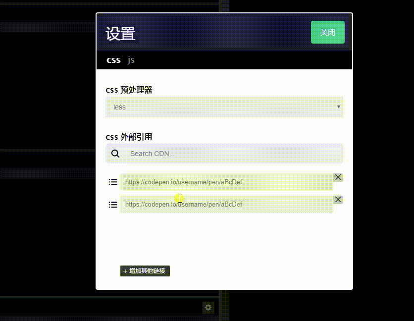

6. 
>支持外部链接关键字搜索
>>

7. 
>支持外部链接拖拽排序
>>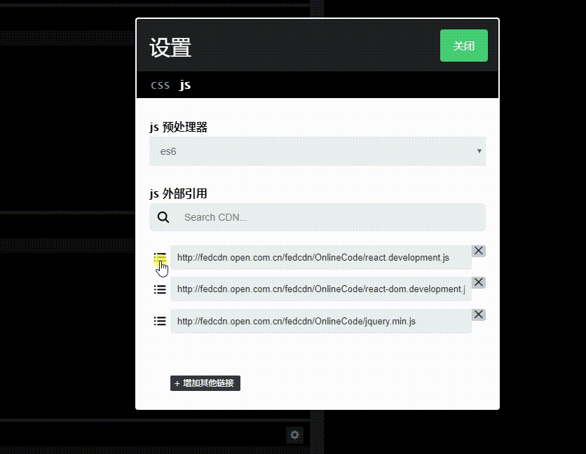

8. 
>支持css预处理器 scss less
>>scss (不支持ie) less (ie11)
>>>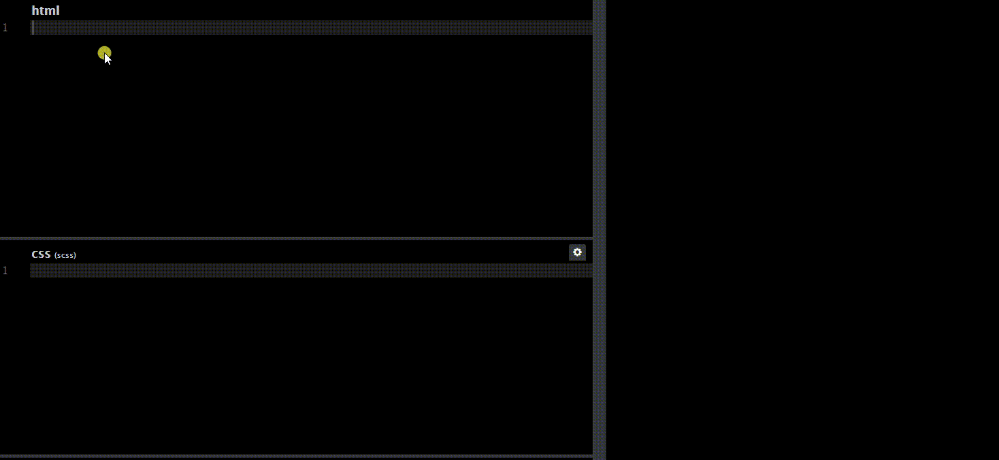

9. 
>支持在线编译es6
>>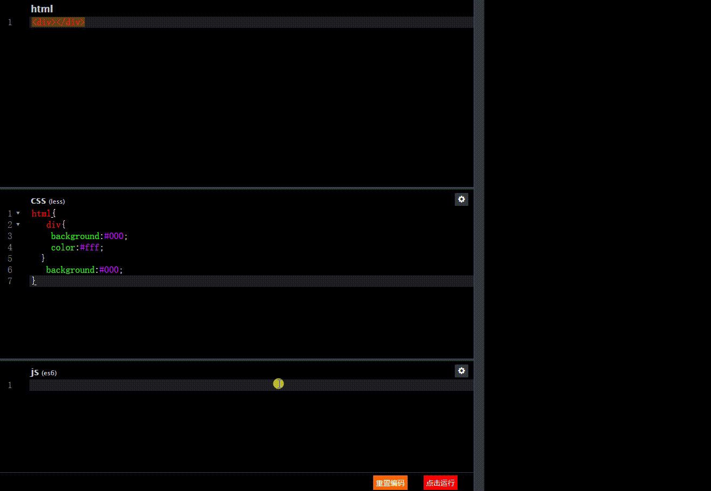

10. 
>支持在线编译typescript
>>不支持语法检测,类型断言

11. 
>支持在线编译Vue
>>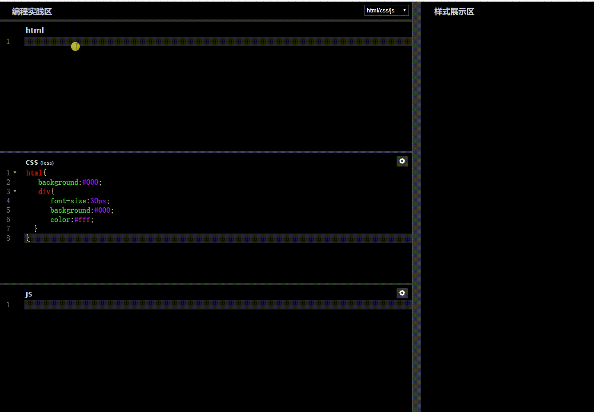

12. 
>支持在线编译react
>>不支持jsx
>>>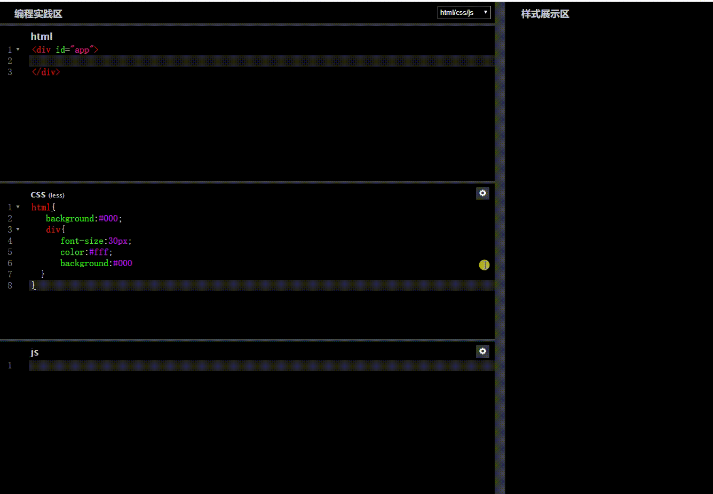

13. 
>支持语言切换
>>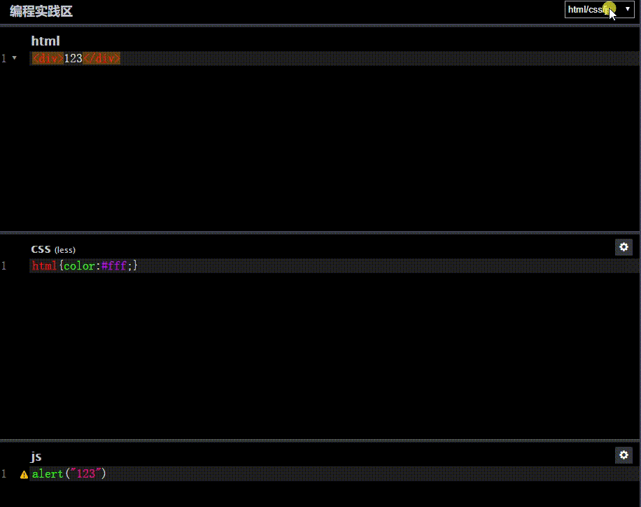

14. 
>支持快捷键

>Tab
>>智能提示 支持 htmlcss js
>>>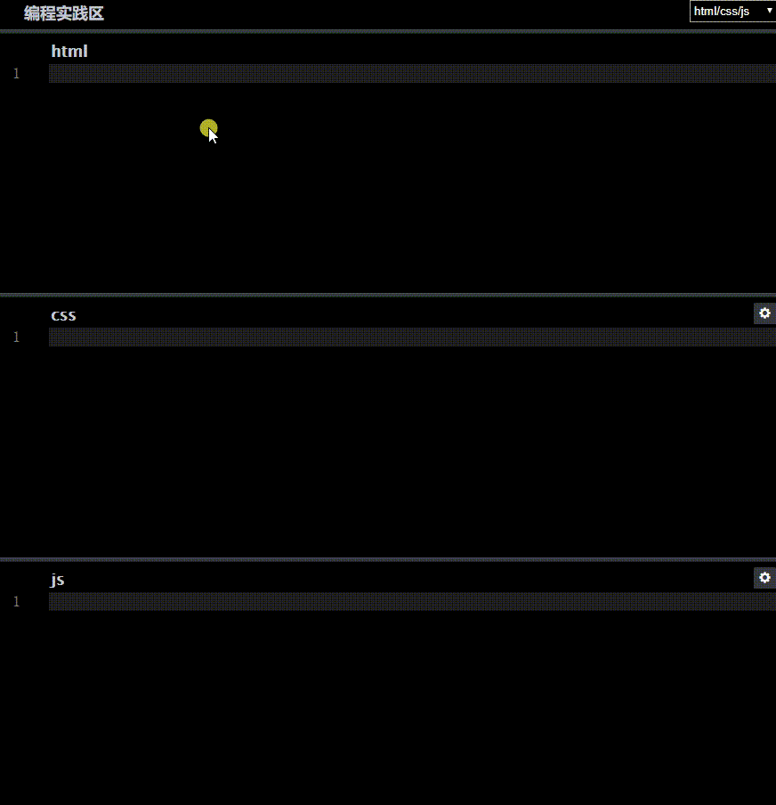

>Ctrl-/:
>>注释
>>>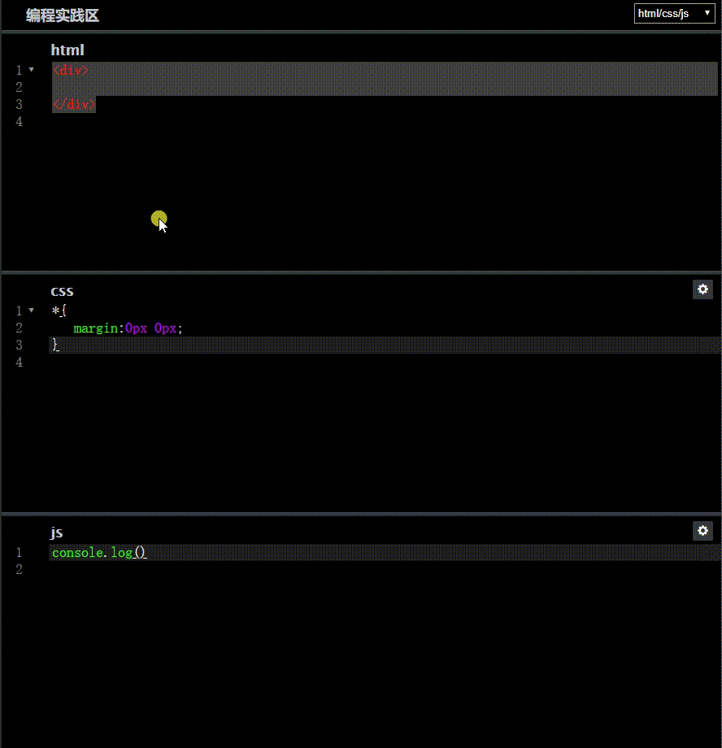

>Ctrl-J:  
>>跳转匹配标签

>Ctrl-F / Cmd-F
>>开始搜索    (Ctrl-F  输入内容  回车)
>>>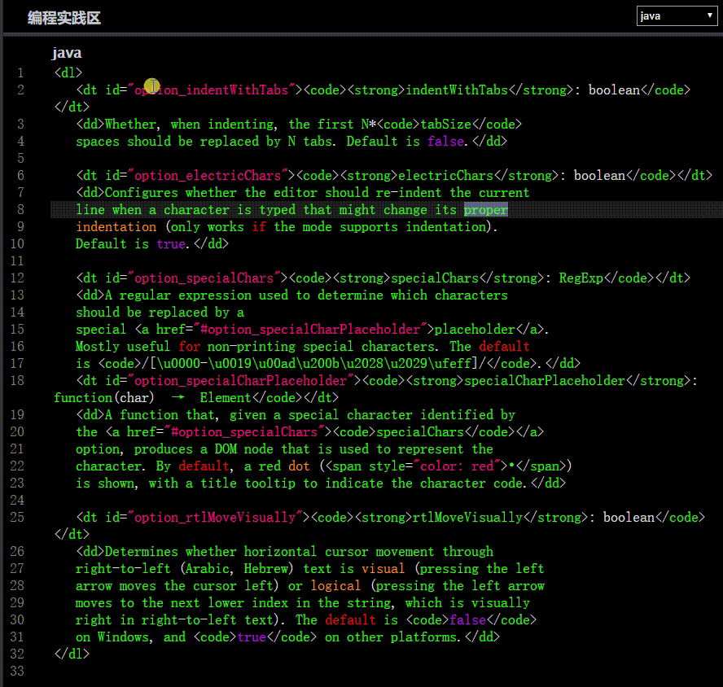

>Ctrl-G / Cmd-G
>>找下一个  (Ctrl-F 匹配内容后   Ctrl-G查找下一个)

>Shift-Ctrl-G / Shift-Cmd-G
>>找到上一个   (Ctrl-F 匹配内容后  Shift-Ctrl-G查找上一个)


#### 属性和接口说明

参数 | 描述 | 类型 | 实例
:-----|:------|:-----|:-----
id | 容器ID | String | id:'test'
readOnly | 编辑器是否可输入 | boolean | readOnly:true
isPaste  | 编辑器是否可粘贴 | boolean | isPaste:true
currentMode | 编辑器初始语言 | String | currentMode:'java'
disabledForSelect | 是否可以切换语言 | boolean | disabledForSelect:true
disabledForInput | 是否禁用外部链接输入框 | boolean | disabledForInput:false
styleAreaIsShow | 是否生成样式展示区 | boolean | styleAreaIsShow:true
iconSettingIsShow | 是否生成设置按钮 | boolean | iconSettingIsShow:true
cssPreprocessor | css 默认处理器 | String | cssPreprocessor: 'less'
jsPreprocessor |  js 默认处理器 | String | jsPreprocessor: 'es6'
defaultExternalLink |  默认引入的外部链接 | Object | defaultExternalLink:{<br>'css':[<br>'http://xxxx.css' <br>], <br> 'js': [ <br> 'http://xxxx.js',<br>'http://xxxx.js'<br>]<br>}
externalLink | 外部链接可选范围 | Object | externalLink: {<br>'js': [<br>{<br>name: 'vue',<br>version: '2.0',<br>link: 'https://xxxx.js'<br>},<br>{<br>name: 'react',<br>version: '16.04',<br>link: 'https://xxxx.js'<br>},<br>{<br>name: 'react-dom',<br>version: '16.04',<br>link: 'https://xxxx.js'<br>},<br>{<br>name: 'jquery',<br>version: '3.3.1',<br>link: 'https://xxxx.js'<br>},<br>{<br>name: 'bootstrap',<br>version: '3.0.0',<br>link: 'https://xxxx.js'<br>}<br>],<br>'css': [<br>{<br>name: 'bootstrap',<br>version: '3.0.0',<br>link: 'https://xxxx.css'<br>}<br>]<br>}
button | 底部按钮表现形势 如果不传 则 不显示 | array | button: [<br>{<br>text: '点击运行',<br>style: 'background: #ff0000'<br>},<br>{<br>text: '重置编码',<br>style: 'background: #ff6600'<br>}<br>]

#### Api

>SetEditorVal()
>>编辑器赋值

```js
SetEditorVal(
	[
		{
			key: 'html',
			val: '<div>123</div>'
		},
		{
			key: 'css',
			val: 'html{color:#fff;}'
		},
		{
			key: 'js',
			val: 'console.log("123")'
		}
	]
)

SetEditorVal(
	[
		{
			key: 'java',
			val: 'value'
		}
	]
)
```

>GetEditorVal()
>>获取编辑器内容

```js
[
	{
		html: '<div>123</div>'
	},
	{
		css: 'html{color:#fff;}'
	},
	{
		js: 'console.log("123")'
	}
]

[
	{
		java: 'value'
	}
]
```

>ResetContent()
>>重置代码

>RequestStyleSetVal()
>>展示区 展示
>>>注意：传入参数数据格式 要和获取内容返回的数据格式保持一致
html css js 语言可以直接展示，后端语言需要调用接口编译后 修改对应语言的val展示

```js
[
	{
		html: '<div>123</div>'
	},
	{
		css: 'html{color:#fff;}'
	},
	{
		js: 'console.log("123")'
	}
]
```

>EventForButton()
>>底部操作按钮事件注册
>>>注意：请按照 下面例子格式传入 text 要与配置的按钮名称一致

```js
EventForButton(
	[
		{
			text: '点击运行', //这里text 要与上面传入的button text一致
			callback: function () {
				console.log('点击运行');
			}
		},
		{
			text: '重置编码',
			callback: function () {
				console.log('重置编码');
			}
		}
	]
)
```

# 我们举一个大栗子

```js
        var Online_Programming = new codemirrorSDK.OnlineProgramming({
            id: 'editor-box', //容器ID
            readOnly: false,//禁用编辑器
            isPaste: false,//是否 禁用粘贴
            currentMode: 'html/css/js',//编辑器 默认 表现形势
            disabledForSelect: false,//是否禁用 select -->是否可以切换 编辑器模式
            disabledForInput: false,//是否禁用 input  -->是否 可以 允许 用户 增加 外部链接
            styleAreaIsShow: true,//是否生成样式展示区
            iconSettingIsShow: true,//是否生成设置按钮
            cssPreprocessor: 'less',//css 默认处理器
            jsPreprocessor: '',//js 默认处理器
            defaultExternalLink: {  //默认引入的外部链接
                'css': [
                    'http://fedcdn.open.com.cn/fedcdn/OnlineCode/bootstrap.min.css'
                ],
                'js': [
                    'http://fedcdn.open.com.cn/fedcdn/OnlineCode/vue.js',
                    'http://fedcdn.open.com.cn/fedcdn/OnlineCode/jquery.min.js'
                ]
            },
            externalLink: { //支持外部链接
                'js': [
                    {
                        name: 'vue',
                        version: '2.0',
                        //link: 'https://cdn.bootcss.com/vue/2.6.4/vue.js'
                        link: 'http://fedcdn.open.com.cn/fedcdn/OnlineCode/vue.js'
                    },
                    {
                        name: 'react',
                        version: '16.4.0',
                        //link: 'https://cdn.staticfile.org/react/16.4.0/umd/react.development.js'
                        link: 'http://fedcdn.open.com.cn/fedcdn/OnlineCode/react.development.js'
                    },
                    {
                        name: 'react-dom',
                        version: '16.4.0',
                        //link: 'https://cdn.staticfile.org/react-dom/16.4.0/umd/react-dom.development.js'
                        link: 'http://fedcdn.open.com.cn/fedcdn/OnlineCode/react-dom.development.js'
                    },
                    {
                        name: 'jquery',
                        version: '1.8.1',
                        //link: 'https://cdn.bootcss.com/jquery/3.3.1/jquery.min.js'
                        link: 'http://fedcdn.open.com.cn/fedcdn/OnlineCode/jquery.min.js'
                    },
                    {
                        name: 'bootstrap',
                        version: '3.3.7',
                        //link: 'https://cdn.jsdelivr.net/npm/bootstrap@3.3.7/dist/js/bootstrap.min.js'
                        link: 'http://fedcdn.open.com.cn/fedcdn/OnlineCode/bootstrap.min.js'
                    }
                ],
                'css': [
                    {
                        name: 'bootstrap',
                        version: '3.3.7',
                        //link: 'https://cdn.jsdelivr.net/npm/bootstrap@3.3.7/dist/css/bootstrap.min.css'
                        link: 'http://fedcdn.open.com.cn/fedcdn/OnlineCode/bootstrap.min.css'
                    }
                ]
            },
            button: [ //底部按钮表现形势    如果不传  则 不显示
                {
                    text: '点击运行',
                    style: 'background: #ff0000'
                },
                {
                    text: '重置编码',
                    style: 'background: #ff6600'
                }
            ]
        });
        //编辑器 模式内容
        Online_Programming.SetEditorVal(
            [
                {
                    key: 'html',
                    val: '<div>123</div>'
                },
                {
                    key: 'css',
                    val: 'html{color:#fff;}'
                },
                {
                    key: 'js',
                    val: 'alert("123")'
                }
            ]
        )
        //编辑器 底部 按钮事件注册
        Online_Programming.EventForButton(
            [
                {
                    text: '点击运行', //这里text 要与上面传入的button text一致
                    callback: function () {
                        // console.log('点击运行');
                        var val = Online_Programming.GetEditorVal(); //获取编辑器内容
                        // console.log(val)
                        Online_Programming.RequestStyleSetVal(val) //展示区 展示   注意：不要改变val 的数据格式
                    }
                },
                {
                    text: '重置编码',
                    callback: function () {
                        // console.log('重置编码');
                        Online_Programming.ResetContent(); //重置代码

                        // Online_Programming.SetEditorVal(  //重置后 是否要显示 默认值
                        //     [
                        //         {
                        //             key: 'html',
                        //             val: '<div>123</div>'
                        //         },
                        //         {
                        //             key: 'css',
                        //             val: 'html{color:#fff;}'
                        //         },
                        //         {
                        //             key: 'js',
                        //             val: 'alert("123")'
                        //         }
                        //     ]
                        // )
                    }
                }
            ]
        )


console.log(Online_Programming)
```